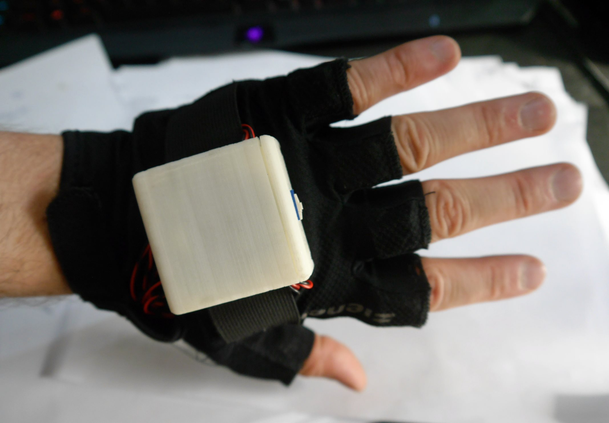
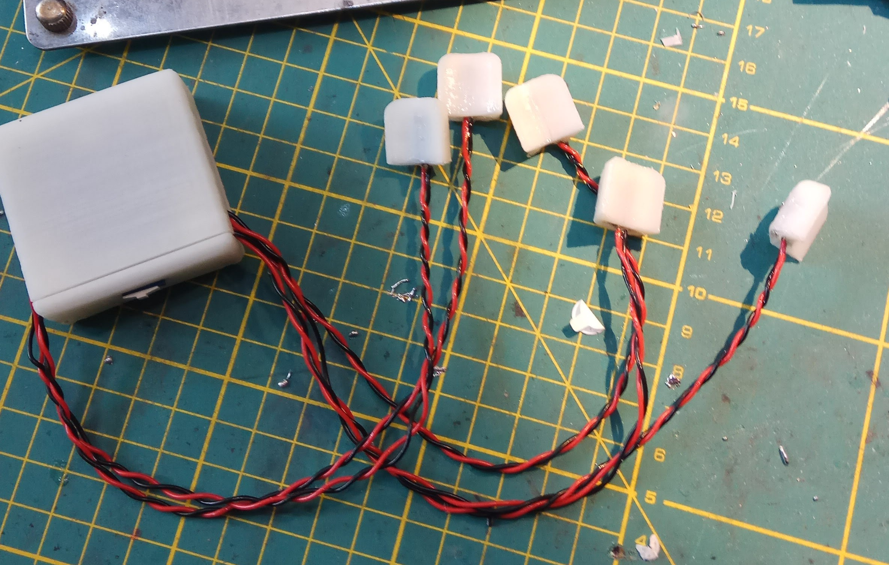
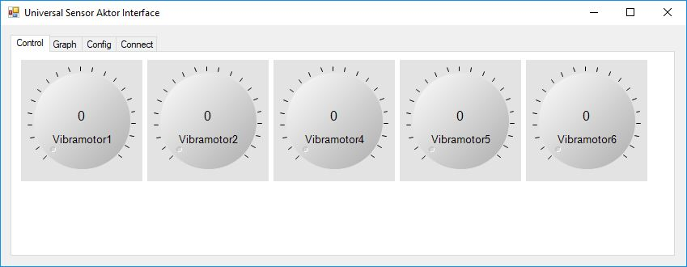
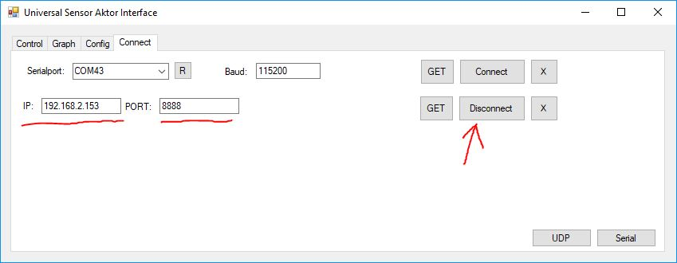

# LIDARsee v2 Feedback Glove





To control the glove you can simply send a UDP packet at the specified port. 

| The library uses a simple ASCII-protocoll to transfer data. 

| Name | : | Value |\r\n|

The UDP packet contains an ASCII string to set vibrationmotor2 to a PWM value of 0:
```
Vibramotor2:0<\r><\n>
```
... to Value 123:
```
Vibramotor2:123<\r><\n>
```
... and multiple values are also possible:
```
Vibramotor1:0<\r><\n>
Vibramotor2:123<\r><\n>
Vibramotor3:456<\r><\n>
Vibramotor4:10<\r><\n>
Vibramotor5:1023<\r><\n>
```

PWM range is from 0 to 1023.

Or use the GUI for testing:




## To Do:
- The power consumption of the vibration motors is quite high, additional capacitors are recommended or limiting the overall power with a software limit
- Connect the motors to the battery directly

The library and the GUI is available under GPL 3.0 at:
- https://github.com/4ndreas/USAI
- https://github.com/4ndreas/USAI_GUI

## License

Hardware License: Creative Commons CC0 https://creativecommons.org/publicdomain/zero/1.0/legalcode

Software license: MIT License
