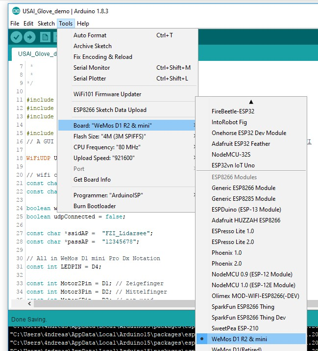

# lidarsee feedback glove Arduino Scetch
## 

Arduino Sketch for the Hardware

- USAI_Glove_demo connects to a Wifi and uses a Soft AP as fallback
- USAI_UDP_Glove uses a Soft AP
- USAI_UDP_WiFi connects to a Wifi 

Set the arduino ide to:

